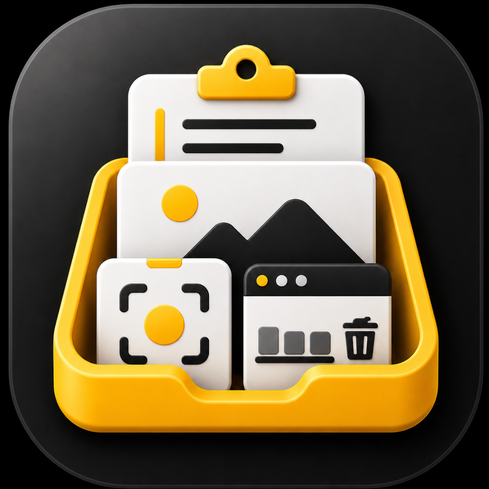
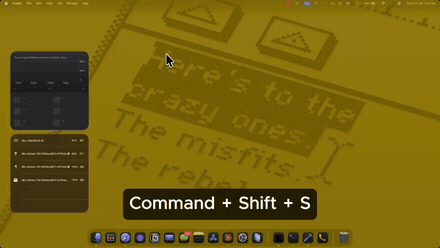
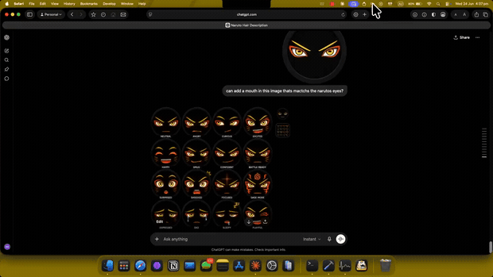
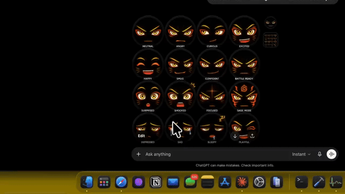
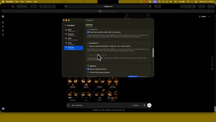
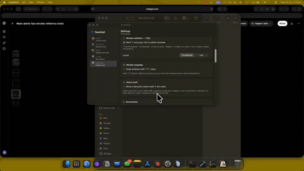

<div align="center">



# FlowShelf

### One Mac app for the dozen little things you copy, grab, and juggle all day.

A self-cleaning shelf for everything you collect — clipboard, screenshots, files,
links — plus window snapping, window previews, a notch shelf, snippets, an app
cleaner, and on-device AI. **One menu-bar icon instead of five separate apps.**

[](https://github.com/mahinkadery/FlowShelf/releases/latest)
[](https://buymeacoffee.com/mahinkadery)


</div>

## See it in action

<div align="center">

**A self-cleaning shelf for everything you copy, grab, and drag**



</div>

<table>
  <tr>
    <td align="center" width="50%"><b>Screenshot studio</b><br/></td>
    <td align="center" width="50%"><b>Notch shelf</b><br/></td>
  </tr>
  <tr>
    <td align="center"><b>On-device AI</b><br/></td>
    <td align="center"><b>Window snapping</b><br/></td>
  </tr>
</table>

> More demos at **[flowshelf.app](https://flowshelf.app)**.

---

## Why FlowShelf?

I got tired of running a separate app for every little thing — a clipboard manager,
a window snapper, a file shelf, an app cleaner, a screenshot tool. Five menu-bar
icons, five subscriptions, and half my RAM gone before I'd done any actual work.

So I built **one** app that does all of it — **native, lightweight (~7 MB), and
private**. Everything stays on your Mac. No account, no cloud, no Electron.

— Mahin, a solo dev trying to make daily Mac life a little less cluttered.

## One app, instead of these

FlowShelf does what I actually used these popular apps for, in a single place:

| What you'd reach for | FlowShelf feature |
|---|---|
| **Paste / Maccy / Dropover** (clipboard + file shelf) | **Shelf** + **Floating shelf** |
| **Magnet / Rectangle** (window snapping) | **Window snapping** |
| **AltTab** + **DockDoor** (window switching & previews) | **⌥-Tab switcher** + **Peek** |
| **CleanShot X / Shottr** (screenshots + annotation) | **Capture + Annotate** |
| **AppCleaner** (uninstaller) | **Clean** |
| **TextExpander** (snippets) | **Snippets** |
| **NotchNook** (notch utility) | **Notch shelf** |

> Not a 1:1 clone of each — it covers the everyday parts most people use, in one
> tidy, free app.

## Features

<!-- 📸 Add a short GIF next to each row as you record them -->

| | |
|---|---|
| 🗂️ **Shelf** | A home for everything you collect — text, links, images, files, screenshots. Search it, pin it, drag items back out. **Auto-clears after 24 hours** so it never piles up — or switch to **Permanent** history if you want a full clipboard manager. |
| 🪟 **Window snapping** | Hold **⌃⌥** and press arrows / `U I J K` / `Return` / `C` to snap the focused window to halves, quarters, maximize, or center. |
| 🎯 **Notch shelf** | A Dynamic-Island-style shelf in your MacBook notch (and a matching pill on external monitors). **Swipe down** to open, drop files in, click a tile to copy. |
| 👀 **Peek** | Hover a Dock icon for **live previews** of that app's windows — click to switch, or close/minimize from the preview. |
| 🔀 **⌥-Tab switcher** | Hold Option, press Tab for a live-thumbnail window switcher across all apps. |
| 📸 **Screenshot studio** | Region & window capture with **local OCR** (Apple Vision), plus a full editor: arrows, shapes, a real **highlighter**, numbered **steps**, text, **redaction** (pixelate / blur / black-out), **spotlight**, a **magnifier callout**, a **pixel ruler**, and gradient **backdrops**. Plus **pin-on-top**, **QR scanning**, image **combine**, and **before/after GIFs**. |
| ✂️ **Snippets** | A searchable library of reusable text — signatures, addresses, canned replies. One click to copy, or grab from the menu-bar menu. |
| 🧹 **Clean** | Drag an app in to uninstall it — FlowShelf finds the leftovers, scores them by confidence, and moves them to the Trash (reversible). It even tells you what it *couldn't* remove and why. |
| ✨ **On-device AI** | See below. |

Plus a **floating drop-shelf** you can shake-summon at your cursor, and a unified
dashboard tying it all together.

## ✨ On-device AI — free, private, no cloud

Powered by Apple's on-device **Foundation Models** — it runs **entirely on your
Mac**. No API keys, no accounts, no subscription, and nothing ever leaves your
machine. (Requires an Apple-Intelligence-capable Mac with Apple Intelligence
enabled. AI runs only when you ask.)

- **Ask AI** — ask anything and it answers using your shelf + snippets as context.
- **Summarize / Clean up / Smart title** any text item.
- **Ask AI ▸** transforms — Reply, Explain, Make formal/casual, Bullet points,
  Translate, or a custom prompt.
- **Smart Search** — type a natural query (*"that tax link"*) and it finds it by
  meaning, not just keywords.
- **Summarize my day** — a friendly recap of everything you collected today.

## Keyboard shortcuts

| Shortcut | Action |
|----------|--------|
| `⌘⇧V` | Open the Shelf / search |
| `⌘⇧S` | Toggle the floating drop-shelf |
| `⌘⇧7` | Screenshot a region → Shelf |
| `⌘⇧O` | Screenshot a region → OCR + Shelf |
| `⌘⇧D` | Open the Dashboard |
| `⌃⌥ ← → ↑ ↓` | Snap window to halves |
| `⌃⌥ U I J K` | Snap window to quarters |
| `⌃⌥ Return / C` | Maximize / center window |

## Privacy

FlowShelf is **private by design**:

- **Everything stays on your Mac** — no accounts, no cloud, no analytics.
- **On-device AI** — prompts and results never leave your machine.
- Clipboard history is stored **owner-only** and **excluded from iCloud / Time
  Machine backups**.
- Password managers and apps you exclude are **never recorded**; **Private Mode**
  pauses capture entirely.
- The **only** network request is a once-a-day check for app updates.

## Install

1. **[Download the latest `.dmg`](https://github.com/mahinkadery/FlowShelf/releases/latest)**
2. Open it and **drag FlowShelf into Applications**.
3. Open FlowShelf normally. The app is **Developer ID signed and notarized by
   Apple**.
4. Grant permissions when asked — **Accessibility** powers Peek, the ⌥-Tab
   switcher, and window snapping; **Screen Recording** adds the live window
   thumbnails. FlowShelf asks only when you first use a feature that needs them.

FlowShelf keeps itself up to date automatically (via Sparkle); you can also check
manually in **Settings → General**.

## Build from source

Requires the Swift toolchain (Xcode Command Line Tools are enough — no full Xcode).

```sh
git clone https://github.com/mahinkadery/FlowShelf.git
cd FlowShelf
make install      # build, bundle, sign, install to /Applications
```

Other targets: `make run` (build + launch), `make dmg` (build a distributable disk
image), `make clean`. Contributors build with an ad-hoc signature by default.

## Architecture

```
FlowShelf.app
├── FlowShelfApp / AppDelegate  – menu-bar status item, popover, wiring
├── Models / Store              – ShelfItem, Snippet, persistence + 24h expiry
├── Clipboard                   – NSPasteboard monitoring
├── Screenshot                  – screencapture, Vision OCR, annotation editor
├── Shelf                       – floating drop-shelf + shake-to-summon
├── Notch                       – Dynamic-Island notch shelf (per display)
├── WindowSnap                  – Magnet-style window snapping (Carbon hotkeys)
├── Peek                        – Dock window previews + ⌥-Tab switcher
├── Cleaner                     – app uninstaller (scan + Trash)
├── AI                          – on-device Foundation Models helpers
├── Dashboard / UI              – SwiftUI views
└── AX / Util                   – Accessibility helpers, updater, helpers
```

Native **Swift + SwiftUI + AppKit**, packaged with Swift Package Manager as a
**universal binary** (Apple Silicon + Intel). Window thumbnails via the same
window-capture API DockDoor/AltTab use; OCR via Apple's **Vision**; on-device AI via
Apple's **Foundation Models**; updates via **Sparkle**.

## Contributing

Issues and pull requests are welcome — see
[CONTRIBUTING.md](CONTRIBUTING.md) and the [changelog](CHANGELOG.md).

## License

FlowShelf is **source-available**, not open-source. You may read, learn from, and
contribute to the code, but you may **not redistribute, sell, or ship your own
copy** of the app, and the **FlowShelf name and icon are reserved**. Licensed under
the **[PolyForm Strict License 1.0.0](LICENSE.md)**.

## Support

FlowShelf is free. If it saves you time, you can
**[buy me a coffee ☕️](https://buymeacoffee.com/mahinkadery)**.

<div align="center">
<sub>Built for Mac by <a href="https://github.com/mahinkadery">@mahinkadery</a></sub>
</div>
