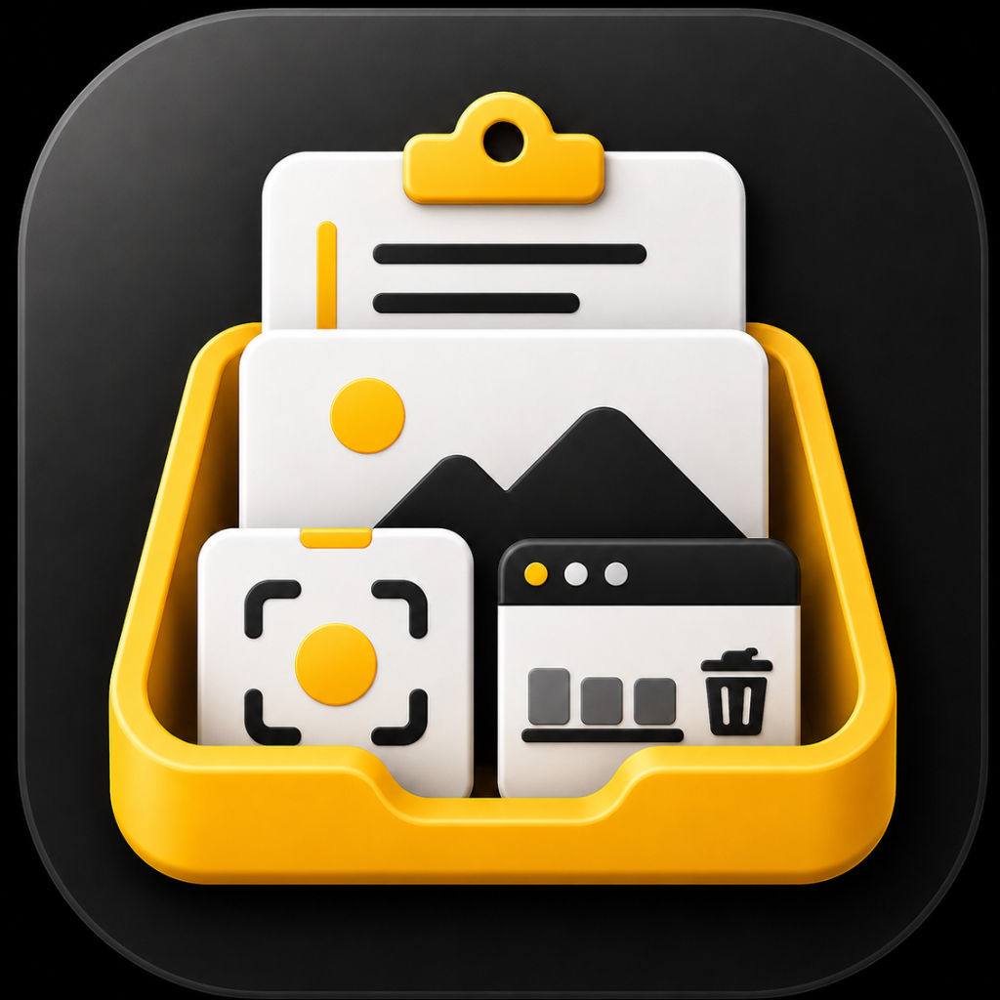

<div align="center">



# FlowShelf

### One Mac app for the dozen little things you copy, grab, and juggle all day.

A self-cleaning shelf for everything you copy, capture and drag — plus a smart
notch with Now Playing, window snapping, Dock previews, a ⌥-Tab switcher, a
screenshot studio, snippets, an app uninstaller and private on-device AI.
**One menu-bar icon instead of a dozen apps.**

<a href="https://flowshelf.app/assets/videos/demos/flowshelf-promo.mp4"></a>

<sub>▶ <a href="https://flowshelf.app/assets/videos/demos/flowshelf-promo.mp4">Watch the 60-second video with sound</a></sub>

[](https://github.com/mahinkadery/FlowShelf/releases/latest)
[](#or-install-with-homebrew)
[](https://flowshelf.app)


[](https://github.com/mahinkadery/FlowShelf/stargazers)

<br/>

⭐ **If FlowShelf makes your Mac day easier, [give it a star](https://github.com/mahinkadery/FlowShelf) —**
it helps other people find it (and gets us closer to a one-word `brew install flowshelf`).

</div>

## See it in action

<div align="center">

**A self-cleaning shelf for everything you copy, grab, and drag** — tap any demo for its full video.

</div>

<table>
  <tr>
    <td align="center" width="50%"><b>Copy &amp; paste</b><br/><a href="https://flowshelf.app/assets/videos/demos/flowshelf-copy-paste.mp4"></a><br/><sub>Every copy lands on one shelf — menu bar, floating shelf and notch.</sub></td>
    <td align="center" width="50%"><b>Notch</b><br/><a href="https://flowshelf.app/assets/videos/demos/flowshelf-notch.mp4"></a><br/><sub>Now Playing, a file shelf and quieter HUDs, right in the notch.</sub></td>
  </tr>
  <tr>
    <td align="center" width="50%"><b>Floating shelf</b><br/><a href="https://flowshelf.app/assets/videos/demos/flowshelf-floating-shelf.mp4"></a><br/><sub><kbd>⌘</kbd><kbd>⇧</kbd><kbd>S</kbd> or a shake. Drop in, drag out anywhere.</sub></td>
    <td align="center" width="50%"><b>Screenshot studio</b><br/><a href="https://flowshelf.app/assets/videos/demos/flowshelf-screenshots.mp4"></a><br/><sub><kbd>⌘</kbd><kbd>⇧</kbd><kbd>7</kbd>, annotate, backdrops, pins — and OCR.</sub></td>
  </tr>
  <tr>
    <td align="center" width="50%"><b>On-device AI</b><br/><a href="https://flowshelf.app/assets/videos/demos/flowshelf-ai.mp4"></a><br/><sub>Smart Search, Summarize, Ask AI. Private, only when you ask.</sub></td>
    <td align="center" width="50%"><b>Snippets</b><br/><a href="https://flowshelf.app/assets/videos/demos/flowshelf-snippets.mp4"></a><br/><sub>Save text you type all the time; copy it in one click.</sub></td>
  </tr>
  <tr>
    <td align="center" width="50%"><b>Window snapping</b><br/><a href="https://flowshelf.app/assets/videos/demos/flowshelf-window-snapping.mp4"></a><br/><sub><kbd>⌃</kbd><kbd>⌥</kbd> + arrows, U I J K, <kbd>⏎</kbd>, C.</sub></td>
    <td align="center" width="50%"><b>Peek</b><br/><a href="https://flowshelf.app/assets/videos/demos/flowshelf-peek.mp4"></a><br/><sub>Hover the Dock to see, close or jump to any window.</sub></td>
  </tr>
  <tr>
    <td align="center" width="50%"><b>⌥-Tab switcher</b><br/><a href="https://flowshelf.app/assets/videos/demos/flowshelf-alt-tab.mp4"></a><br/><sub>Switch windows, not just apps — grid or list.</sub></td>
    <td align="center" width="50%"><b>Clean</b><br/><a href="https://flowshelf.app/assets/videos/demos/flowshelf-clean.mp4"></a><br/><sub>Uninstall apps, leftovers included. Put Back any time.</sub></td>
  </tr>
</table>

> More demos at **[flowshelf.app](https://flowshelf.app)**.

---

## Why FlowShelf?

I got tired of running a separate app for every little thing — a clipboard manager,
a window snapper, a file shelf, an app cleaner, a screenshot tool. Five menu-bar
icons, five subscriptions, and half my RAM gone before I'd done any actual work.

So I built **one** app that does all of it — **native, lightweight (about a
10 MB download), and private**. Everything stays on your Mac. No account, no
cloud, no Electron.

— Mahin, a solo dev trying to make daily Mac life a little less cluttered.

## One app, instead of these

FlowShelf does what I actually used these popular apps for, in a single place:

| What you'd reach for | FlowShelf feature |
|---|---|
| **Paste / Maccy / Dropover** (clipboard + file shelf) | **Shelf** + **Floating shelf** |
| **Magnet / Rectangle** (window snapping) | **Window snapping** |
| **AltTab** + **DockDoor** (window switching & previews) | **⌥-Tab switcher** + **Peek** |
| **CleanShot X / Shottr** (screenshots + annotation) | **Screenshot studio** |
| **AppCleaner** (uninstaller) | **Clean** |
| **TextExpander** (snippets) | **Snippets** |
| **NotchNook** (notch utility) | **Notch** — shelf, Now Playing, HUDs |

> Not a 1:1 clone of each — it covers the everyday parts most people use, in one
> tidy, free app. The **Screenshot studio** in particular has grown into a full
> toolkit (annotate, redact, magnify, measure, beautify) — see below.

## Features

| | |
|---|---|
| 🗂️ **Shelf** | Everything you copy lands here — text, links, images, files, screenshots — with the app it came from. Click to copy it back, drag it out, pin what matters. **Select several items** to copy or drag them together. Search by name, by meaning (AI), or — if you turn it on — by the **text inside your images**. Items **clear themselves after 24 hours**, or keep everything with **Permanent** history. Open it from the menu bar or with `⌘⇧V`. |
| 🧲 **Floating shelf** | A Liquid Glass shelf that opens right under your pointer with `⌘⇧S` (or a shake, if you turn that on). Drop anything in, drag it out into any app. |
| 🎯 **Notch** | A Dynamic-Island-style notch (and a matching pill on Macs without one). **Click it** for your shelf, or start dragging a file and it opens to catch it. **Now Playing** shows the album art and live audio bars tinted to match; open it for a mini player and a **Sound Output** picker. Volume, brightness, charging, low battery, Low Power Mode and AirPods/headphone switches show as neat notch HUDs. |
| 📸 **Screenshot studio** | Region (`⌘⇧7`) and window capture, plus `⌘⇧O` to copy the text out of anything (local OCR with Apple Vision). A full editor: arrows, shapes, a real **highlighter**, numbered **steps**, text, **redaction** (pixelate / blur / black-out), **spotlight**, a **magnifier callout**, a **pixel ruler**, **crop**, and gradient **backdrops**. Plus **pin-on-top**, **QR scanning**, image **combine**, and **before/after GIFs**. |
| 🪟 **Window snapping** | Hold `⌃⌥` and press the arrows for halves, `U I J K` for quarters, `Return` to maximize, `C` to center. |
| 👀 **Peek** | Hover a Dock icon for **live previews** of that app's windows (small, medium or large) — click one to switch, or close/minimize it right from the preview. |
| 🔀 **⌥-Tab switcher** | Hold `⌥` and tap `Tab` for every window, live — `⇧` goes back, release to jump. Thumbnails or a compact list; the shortcut is yours to change. |
| ✂️ **Snippets** | A searchable library of reusable text — signatures, addresses, canned replies — with optional keywords. One click to copy, or grab one from the menu-bar icon's right-click menu. |
| 🧹 **Clean** | Drag an app in to uninstall it — FlowShelf finds the leftovers, scores each match (low-confidence ones start unchecked), and moves them to the Trash so **Put Back** still works. A cleanup report lands on your shelf, including anything it *couldn't* remove and why. |
| ✨ **On-device AI** | See below. |

All of it lives in one dashboard (`⌘⇧D`, then `⌘1`–`⌘7` to jump between sections).

## ✨ On-device AI — free, private, no cloud

Powered by Apple's on-device **Foundation Models** — it runs **entirely on your
Mac**. No API keys, no accounts, no subscription, and nothing ever leaves your
machine. (Requires an Apple-Intelligence-capable Mac with Apple Intelligence
enabled. AI runs only when you ask.)

- **Ask AI** — ask anything and it answers using your shelf + snippets as context.
- **Summarize / Clean up / Smart title** any text item.
- **Ask AI ▸** transforms — Reply, Explain, Make formal/casual, Bullet points,
  Translate, or a custom prompt.
- **Smart Search** — type a natural query (*"that tax link"*) and it finds it by
  meaning, not just keywords.
- **Summarize my day** — a friendly recap of everything you collected today.
- Results open in a small window with **Copy** and **Add to Shelf** — nothing is
  added or changed until you choose.

## Keyboard shortcuts

| Shortcut | Action |
|----------|--------|
| `⌘⇧V` | Open the Shelf / search |
| `⌘⇧S` | Toggle the floating drop-shelf |
| `⌘⇧7` | Screenshot a region → Shelf |
| `⌘⇧O` | Screenshot a region → OCR + Shelf |
| `⌘⇧D` | Open the Dashboard |
| `⌥ Tab` | Window switcher (`⇧` to go back) |
| `⌃⌥ ← → ↑ ↓` | Snap window to halves |
| `⌃⌥ U I J K` | Snap window to quarters |
| `⌃⌥ Return / C` | Maximize / center window |

## Privacy

FlowShelf is **private by design**:

- **Everything stays on your Mac** — no accounts, no cloud, no analytics.
- **On-device AI** — prompts and results never leave your machine.
- Clipboard history is stored **owner-only** and **excluded from iCloud / Time
  Machine backups**.
- Password managers' private copies and apps you exclude are **never recorded**,
  and you can add **your own clipboard types to ignore**. **Private Mode** pauses
  capture entirely.
- **Text-in-image search is off until you turn it on**, runs on your Mac, and what
  it has read can be cleared at any time.
- The **only** network request is a once-a-day check for app updates.

## Install

1. **[Download the latest `.dmg`](https://github.com/mahinkadery/FlowShelf/releases/latest)**
2. Open it and **drag FlowShelf into Applications** (if you open it from the
   disk image or Downloads, FlowShelf offers to move itself there so its
   permissions stick).
3. Open FlowShelf normally. The app is **Developer ID signed and notarized by
   Apple**.
4. Grant permissions when asked — **Accessibility** powers Peek, the ⌥-Tab
   switcher, and window snapping; **Screen Recording** adds the live window
   thumbnails. FlowShelf asks only when you first use a feature that needs them.

FlowShelf keeps itself up to date automatically (via Sparkle); you can also check
manually in **Settings → General**.

### Or install with Homebrew

```sh
brew install --cask mahinkadery/tap/flowshelf
```

Same signed, notarized build as the direct download. Verify any release with its
SHA-256 checksum, published in the [release notes](https://github.com/mahinkadery/FlowShelf/releases/latest).

## Troubleshooting

<details>
<summary><b>The AI features say they're unavailable</b></summary>

On-device AI needs an **Apple-Intelligence-capable Mac** with **Apple Intelligence
enabled** (System Settings → Apple Intelligence & Siri). One easy-to-miss catch:
Apple Intelligence won't turn on unless your Mac's **system language matches your
Siri language** — if they differ (e.g. system "English (US)", Siri "English (AU)"),
set them the same and it'll enable. AI only runs when you explicitly ask.
</details>

<details>
<summary><b>A feature stopped working after an update (Peek, ⌥-Tab, snapping, window thumbnails)</b></summary>

Those need **Accessibility** and/or **Screen Recording** permission, and FlowShelf
should run from your **Applications** folder — macOS forgets permissions for apps
opened straight from a disk image or Downloads. FlowShelf uses
a stable Developer ID signature so grants normally persist across updates, but if
macOS drops one, re-enable FlowShelf under **System Settings → Privacy & Security →
Accessibility / Screen Recording**.
</details>

<details>
<summary><b>Where is my data stored? Can I wipe it?</b></summary>

Everything lives **on your Mac only** — no cloud, no account. History is stored in
FlowShelf's Application Support folder, owner-only, and excluded from iCloud/Time
Machine. Use **Clear** in the app to wipe it, or turn on **Private Mode** to pause
capture entirely.
</details>

<details>
<summary><b>"FlowShelf can't be opened"</b></summary>

Since 1.3.4 the app is **notarized by Apple**, so it should open normally. If you're
on an older build or macOS still blocks it, right-click the app → **Open**, or allow
it under **System Settings → Privacy & Security**.
</details>

## Build from source

Requires the Swift toolchain (Xcode Command Line Tools are enough — no full Xcode).

```sh
git clone https://github.com/mahinkadery/FlowShelf.git
cd FlowShelf
make install      # build, bundle, sign, install to /Applications
```

Other targets: `make run` (build + launch), `make dmg` (build a distributable disk
image), `make clean`. Contributors build with an ad-hoc signature by default.

## Architecture

```
FlowShelf.app
├── FlowShelfApp / AppDelegate  – menu-bar status item, popover, wiring
├── Models / Store              – ShelfItem, Snippet, persistence + 24h expiry
├── Clipboard                   – NSPasteboard monitoring + privacy rules
├── Screenshot                  – screencapture, Vision OCR, annotation editor
├── Shelf                       – floating drop-shelf + shake-to-summon
├── Notch                       – notch shelf, Now Playing, HUDs (per display)
├── WindowSnap                  – Magnet-style window snapping (Carbon hotkeys)
├── Peek                        – Dock window previews + ⌥-Tab switcher
├── Cleaner                     – app uninstaller (scan + Trash)
├── AI                          – on-device Foundation Models helpers
├── Dashboard / UI              – SwiftUI views
└── AX / Util                   – Accessibility helpers, updater, helpers
```

Native **Swift + SwiftUI + AppKit**, packaged with Swift Package Manager as a
**universal binary** (Apple Silicon + Intel). Window thumbnails via the same
window-capture API DockDoor/AltTab use; OCR via Apple's **Vision**; on-device AI via
Apple's **Foundation Models**; updates via **Sparkle**.

## Contributing

Issues and pull requests are welcome — see
[CONTRIBUTING.md](CONTRIBUTING.md) and the [changelog](CHANGELOG.md).

## License

FlowShelf is **source-available**, not open-source. You may read, learn from, and
contribute to the code, but you may **not redistribute, sell, or ship your own
copy** of the app, and the **FlowShelf name and icon are reserved**. Licensed under
the **[PolyForm Strict License 1.0.0](LICENSE.md)**.

## Support

FlowShelf is free. Two things help a lot:

- ⭐ **[Star the repo](https://github.com/mahinkadery/FlowShelf)** — it's the biggest
  boost for a solo project (and helps unlock a shorter `brew install`).
- ☕ **[Buy me a coffee](https://buymeacoffee.com/mahinkadery)** if it saves you time.

<div align="center">
<sub>Built for Mac by <a href="https://github.com/mahinkadery">@mahinkadery</a></sub>
</div>
